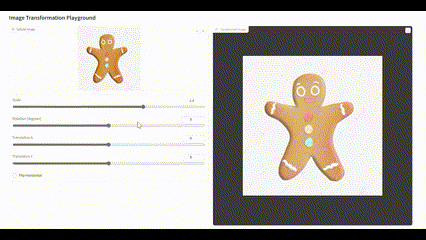
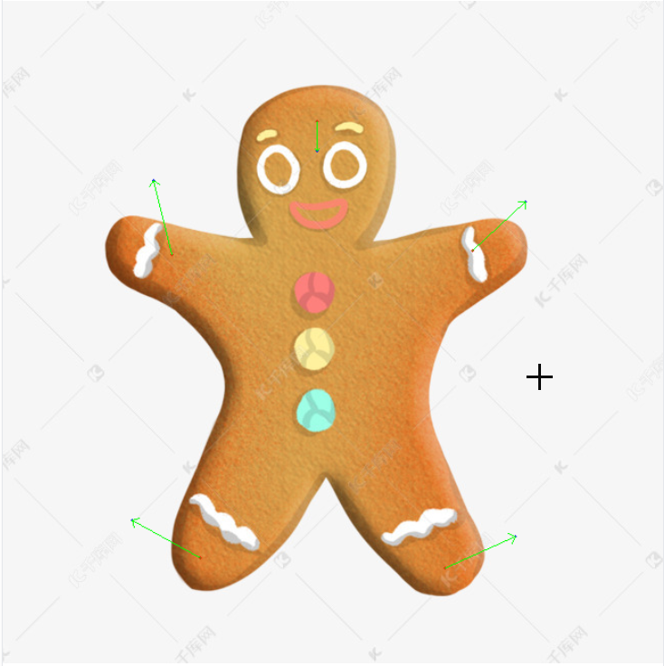
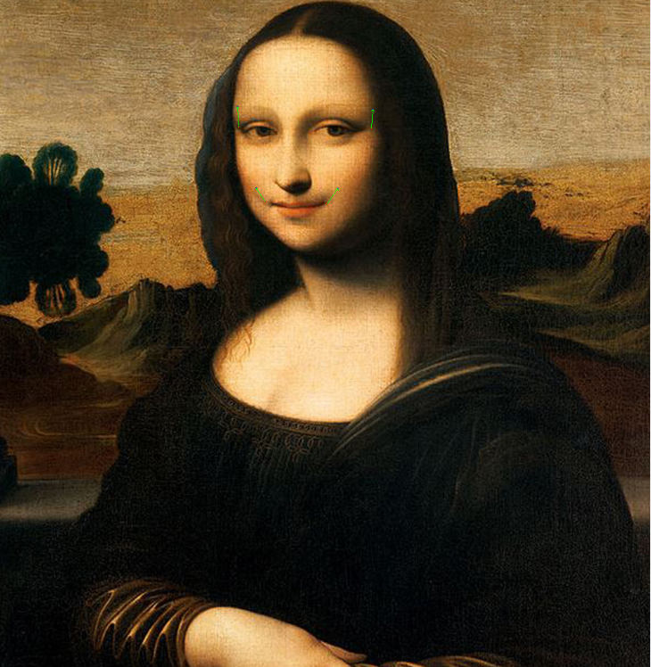
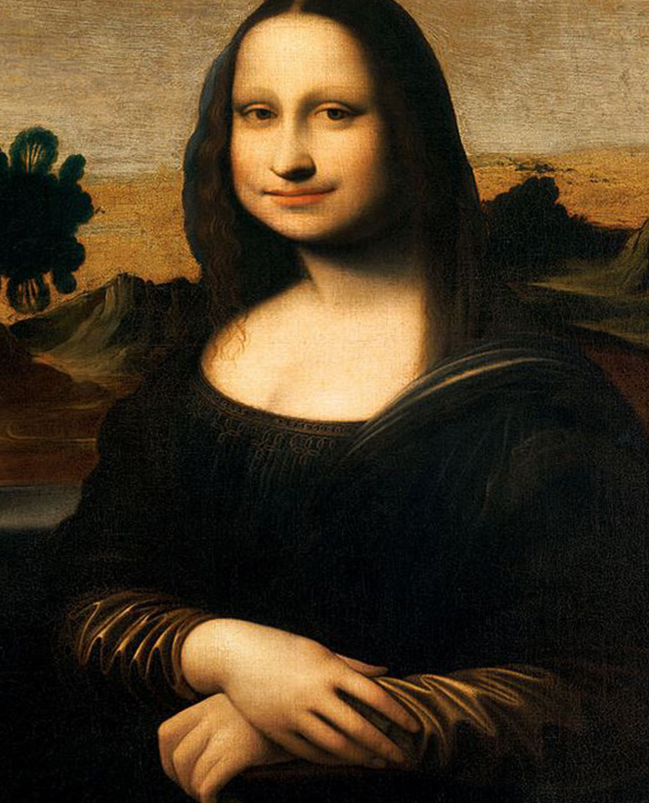

# Assignment 1 - Image Warping
### PB21010440 辛海洋

## 几何变换的实现

## Requirements
To install requirements:

```setup
python -m pip install -r requirements.txt
```
## Running

To run basic transformation, run:

```basic
python run_global_transform.py
```

To run point guided transformation, run:

```point
python run_point_transform.py
```
## Results 
### Basic Transformation
#### Test 1


#### Test 2



### Point Guided Deformation:

#### Test 1
采点图


变形图


#### Test 2
采点图


变形图


## 技术细节
### Basic Transformation
可以以采用反向映射，这样结果不会有黑缝；也可以采用cv2,WarpAffine()函数，输入变换矩阵后会自动填补图片中的黑缝。

### Point Guided Deformation
实现了MLS中的Affine Deformations 。程序中采用张量化代替for循环来大大提高运行速度，同时，使用cv2.Remap()函数，来做反向变换，这样映射后的图像没有黑缝。
