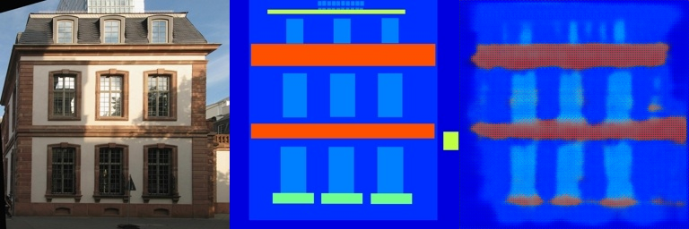
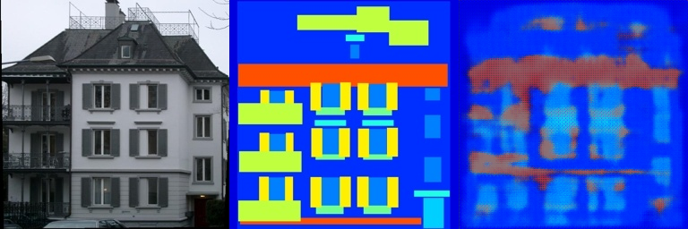
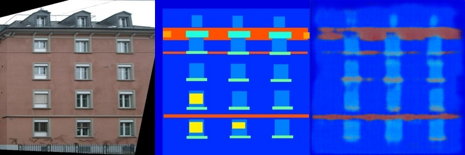
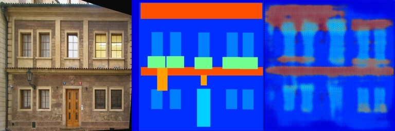

# Assignment 2 - Implement Pix2Pix with Fully Convolutional Layers
###  PB21010440 辛海洋

## Requirements
To install requirements:

```setup
python -m pip install -r requirements.txt
```
## Run
```bash
bash download_facades_dataset.sh
python train.py
```

## Results

本实验选用5层卷积网络，5层反卷积网络，最终训练集和验证集损失函数均在0.3左右。

### Train  results
#### picture 1



#### picture 2


#### picture 3


### Validation results
#### picture 1


#### picture 2


#### picture 3
