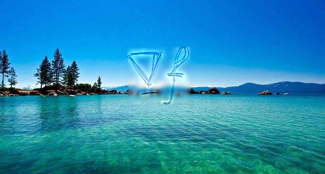
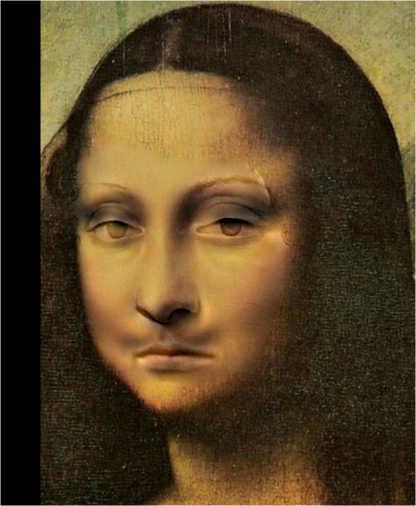
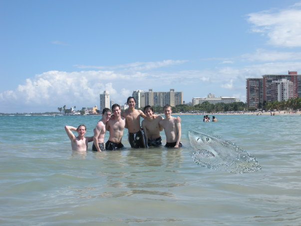

# Assignment 2 - DIP with PyTorch

### PB21010440 辛海洋

## Requirements
To install requirements:

```setup
python -m pip install -r requirements.txt
```

## Running
```setup
python run_blending_gradio.py
```

## Results

本次实验只训练了3000轮，三张图片的融合结果如下所示：

### Test 1


### Test 2


### Test 3


