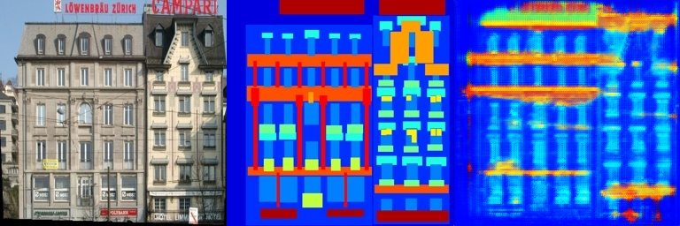

# 基于 Pix2Pix + GAN 的图像语义分割
###  PB21010440 辛海洋

### 网络结构

仿照 GAN 的思路，实验中用到的网络的主要结构有：
- 判别器
  - 判别器采用PatchGAN结构，输出一个判别矩阵而不是单一的判别值。
- 生成器
  - 生成器采用U-Net结构，包含编码器和解码器，并有跳跃连接，编码与解码器均采用五层的全卷积网络

### 判别器
核心代码如下：
```python
class Discriminator(nn.Module):
    def __init__(self, dropout_rate=0.3):
        super(Discriminator, self).__init__()
        
        # 恢复原来的通道数，但保持结构清晰
        self.initial = nn.Sequential(
            nn.Conv2d(6, 64, kernel_size=4, stride=2, padding=1),
            nn.LeakyReLU(0.2, inplace=True)
        )
        
        self.middle1 = nn.Sequential(
            nn.Conv2d(64, 128, kernel_size=4, stride=2, padding=1),
            nn.BatchNorm2d(128),
            nn.LeakyReLU(0.2, inplace=True),
            nn.Dropout2d(dropout_rate)
        )
        
        self.middle2 = nn.Sequential(
            nn.Conv2d(128, 256, kernel_size=4, stride=2, padding=1),
            nn.BatchNorm2d(256),
            nn.LeakyReLU(0.2, inplace=True),
            nn.Dropout2d(dropout_rate)
        )
        
        self.middle3 = nn.Sequential(
            nn.Conv2d(256, 512, kernel_size=4, stride=2, padding=1),
            nn.BatchNorm2d(512),
            nn.LeakyReLU(0.2, inplace=True),
            nn.Dropout2d(dropout_rate)
        )
        
        self.final = nn.Sequential(
            nn.Conv2d(512, 1, kernel_size=4, stride=1, padding=1),
            nn.Sigmoid()
        )

    def forward(self, x, y, get_features=False):
        # 将输入图像和目标图像在通道维度上拼接
        input_tensor = torch.cat((x, y), 1)
        
        # 获取中间特征
        feat1 = self.initial(input_tensor)
        feat2 = self.middle1(feat1)
        feat3 = self.middle2(feat2)
        feat4 = self.middle3(feat3)
        output = self.final(feat4)
        
        if get_features:
            return output, [feat1, feat2, feat3, feat4]
        return output
```

### 生成器
核心代码如下：
```python
class FullyConvNetwork(nn.Module):
    def __init__(self, dropout_rate=0.5):
        super().__init__()
        
        # Encoder (Convolutional Layers)
        self.conv1 = nn.Sequential(
            nn.Conv2d(3, 16, kernel_size=4, stride=2, padding=1),  # Input channels: 3, Output channels: 8
            nn.BatchNorm2d(16),
            nn.ReLU(inplace=True),
            nn.Dropout2d(dropout_rate)
        )
        self.conv2 = nn.Sequential(
            nn.Conv2d(16, 64, kernel_size=4, stride=2, padding=1),  # Input channels: 8, Output channels: 16
            nn.BatchNorm2d(64),
            nn.ReLU(inplace=True),
            nn.Dropout2d(dropout_rate)
        )
        self.conv3 = nn.Sequential(
            nn.Conv2d(64, 256, kernel_size=4, stride=2, padding=1),  # Input channels: 8, Output channels: 16
            nn.BatchNorm2d(256),
            nn.ReLU(inplace=True),
            nn.Dropout2d(dropout_rate)
        )
        self.conv4 = nn.Sequential(
            nn.Conv2d(256, 512, kernel_size=4, stride=2, padding=1),  # Input channels: 16, Output channels: 32
            nn.BatchNorm2d(512),
            nn.ReLU(inplace=True),
            nn.Dropout2d(dropout_rate)
        )
        self.conv5 = nn.Sequential(
            nn.Conv2d(512, 1024, kernel_size=4, stride=2, padding=1),  # Input channels: 32, Output channels: 64
            nn.BatchNorm2d(1024),
            nn.ReLU(inplace=True),
            nn.Dropout2d(dropout_rate)
        )
        
        # Decoder (Deconvolutional Layers)
        self.deconv1 = nn.Sequential(
            nn.ConvTranspose2d(1024, 512, kernel_size=4, stride=2, padding=1),  # Output channels: 32
            nn.BatchNorm2d(512),
            nn.ReLU(inplace=True),
            nn.Dropout2d(dropout_rate)
        )
        self.deconv2 = nn.Sequential(
            nn.ConvTranspose2d(1024, 256, kernel_size=4, stride=2, padding=1),  # Output channels: 16
            nn.BatchNorm2d(256),
            nn.ReLU(inplace=True),
            nn.Dropout2d(dropout_rate)
        )
        self.deconv3 = nn.Sequential(
            nn.ConvTranspose2d(512, 64, kernel_size=4, stride=2, padding=1),   # Output channels: 8
            nn.BatchNorm2d(64),
            nn.ReLU(inplace=True),
            nn.Dropout2d(dropout_rate)
        )
        self.deconv4 = nn.Sequential(
            nn.ConvTranspose2d(128, 16, kernel_size=4, stride=2, padding=1),   # Output channels: 8
            nn.BatchNorm2d(16),
            nn.ReLU(inplace=True),
            nn.Dropout2d(dropout_rate)
        )
        self.deconv5 = nn.Sequential(
            nn.ConvTranspose2d(32, 3, kernel_size=4, stride=2, padding=1),    # Output channels: 3 for RGB
            nn.Tanh()  # Since last layer outputs RGB, we use Sigmoid for normalized output
        )

    def forward(self, x):
        # 添加输入数据的归一化
        x = (x + 1.0) / 2.0  # 将[-1,1]范围转换为[0,1]范围
        
        # Encoder forward pass
        x1 = self.conv1(x)
        x2 = self.conv2(x1)
        x3 = self.conv3(x2)
        x4 = self.conv4(x3)
        x5 = self.conv5(x4)
        
        # Decoder forward pass
        d1 = self.deconv1(x5)
        d1_cat = torch.cat([d1, x4], 1)
        
        d2 = self.deconv2(d1_cat)
        d2_cat = torch.cat([d2, x3], 1)
        
        d3 = self.deconv3(d2_cat)
        d3_cat = torch.cat([d3, x2], 1)
        
        d4 = self.deconv4(d3_cat)
        d4_cat = torch.cat([d4, x1], 1)
        
        output = self.deconv5(d4_cat)
        
        return output
```
## Requirements
To install requirements:

```setup
python -m pip install -r requirements.txt
```
## Run
```bash
bash download_facades_dataset.sh
python train.py
```
## Results
<div align="center">
    
    
    
    
    
</div>


