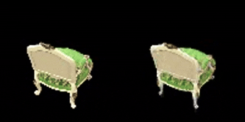
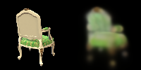
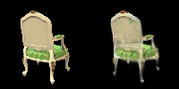
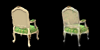
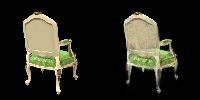
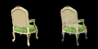

# 3D Gaussian Splatting 的复现
This repository is the official implementation of [My Paper Title](https://repo-sam.inria.fr/fungraph/3d-gaussian-splatting/)

## Requirements
  First install COLMAP software, then create a virtual environment and run:
  ```setup
pip install -r requirements.txt
```
## Training
### Step 1. Structure-from-Motion
First, we use Colmap to recover camera poses and a set of 3D points
```
python mvs_with_colmap.py --data_dir data/chair
```
Debug the reconstruction by running:
```
python debug_mvs_by_projecting_pts.py --data_dir data/chair
```
### Step 2. Training 3D Gaussian Splatting
```
python train.py --colmap_dir data/chair --checkpoint_dir data/chair/checkpoints
```
## Pre-trained Models
You can download pretrained models here:
- [My awesome model](https://rec.ustc.edu.cn/share/dd7bf1c0-d1b9-11ef-9fe4-75b944d6a870)
- 提取码：0000

You can also download the video of the reconstructed scene from the website.

## Results
The following results are obtained after training for 200 epochs on the chair dataset
  <!-- This is a GIF animation of the reconstructed scene -->
### Some pictures
下面分别是训练0，50，100，150，199个epoch后在r_74上的结果





